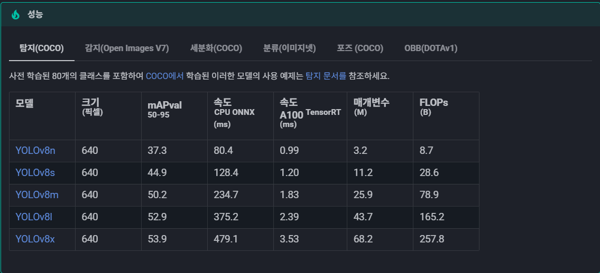

[모델] YOLO(you only look once)
==
> 이 글에서는 YOLO 모델의 사용법을 위주로 설명한다.
> 특히 탐지 부분에서만 설명되어 있다.
---
# 1. 모델 다운로드
yolo 모델은 현재 파이썬의 `ultralytics`에서 제공 중이다.
따라서 일단 라이브러리를 `import`해야한다.

```python
from ultralytics import YOLO
```
>당연히 `pip install ultralytics`는 했을 거라 믿는다.

이후 모델은 아래 형식으로 작성하여 다운로드 할 수 있다.
```python
model = YOLO("<다운로드할 모델의 버전>")
```

## 1.1. 모델의 종류
버전은 작성일(2025.07.10.) 기준 yolo v11까지 나와있는 상태이다.
각 버전을 알고 싶다면 [여기서](https://docs.ultralytics.com/ko/models/#featured-models) 알아볼 수 있다.


> n, s, m, l, x 순으로 갈수록 모델의 매개변수 수가 증가한다.
> 즉 x는 속도는 느리지만 정교하고, n는 빠르지만 정확도가 떨어진다

---
# 2. 모델 학습하기
## 2.0. 구조


## 2.1. YOLO.train()
YOLO 모델을 학습 시킬 때는 train 메소드를 이용한다.
이때 메소드의 인수는 아래와 같다

<details>
<summary>전체 인수 목록 접기/펼치기</summary>

<br>

|인수|유형|기본값|설명|
|---|---|---|---|
|`model`|`str`|`None`|학습할 모델 파일을 지정합니다. 다음 중 하나의 경로를 허용합니다. `.pt` 사전 학습된 모델 또는 `.yaml` 구성 파일. 모델 구조를 정의하거나 가중치를 초기화하는 데 필수적입니다.|
|`data`|`str`|`None`|데이터 집합 구성 파일의 경로(예:, `coco8.yaml`). 이 파일에는 트레이닝 경로를 비롯한 데이터 세트별 매개변수와 [유효성 검사 데이터](https://www.ultralytics.com/glossary/validation-data), 클래스 이름, 클래스 수를 입력합니다.|
|`epochs`|`int`|`100`|총 훈련 에포크 수입니다. 각 [에포크는](https://www.ultralytics.com/glossary/epoch) 전체 데이터 세트에 대한 전체 패스를 나타냅니다. 이 값을 조정하면 학습 기간과 모델 성능에 영향을 줄 수 있습니다.|
|`time`|`float`|`None`|최대 훈련 시간(시간). 설정하면 이 값은 `epochs` 인수를 사용하여 지정된 시간 후에 트레이닝을 자동으로 중지할 수 있습니다. 시간 제약이 있는 교육 시나리오에 유용합니다.|
|`patience`|`int`|`100`|훈련을 조기 중단하기 전에 검증 지표의 개선 없이 기다려야 하는 에포크 수입니다. 성능이 정체될 때 훈련을 중단하여 [과적합을](https://www.ultralytics.com/glossary/overfitting) 방지합니다.|
|`batch`|`int` 또는 `float`|`16`|[배치 크기](https://www.ultralytics.com/glossary/batch-size)세 가지 모드가 있습니다(예: 정수로 설정), `batch=16`), 60% GPU 메모리 사용률의 자동 모드(`batch=-1`) 또는 지정된 사용률 비율의 자동 모드(`batch=0.70`).|
|`imgsz`|`int` 또는 `list`|`640`|학습을 위한 목표 이미지 크기입니다. 모든 이미지는 모델에 입력되기 전에 이 크기로 조정됩니다. 모델 [정확도와](https://www.ultralytics.com/glossary/accuracy) 계산 복잡도에 영향을 줍니다.|
|`save`|`bool`|`True`|훈련 체크포인트와 최종 모델 가중치를 저장할 수 있습니다. 훈련 또는 [모델 배포를](https://www.ultralytics.com/glossary/model-deployment) 재개할 때 유용합니다.|
|`save_period`|`int`|`-1`|모델 체크포인트 저장 빈도(에포크 단위로 지정)입니다. 값이 -1이면 이 기능이 비활성화됩니다. 긴 훈련 세션 동안 중간 모델을 저장할 때 유용합니다.|
|`cache`|`bool`|`False`|메모리에서 데이터 세트 이미지의 캐싱을 활성화합니다(`True`/`ram`), 디스크(`disk`) 또는 비활성화(`False`). 메모리 사용량을 늘리는 대신 디스크 I/O를 줄여 훈련 속도를 향상시킵니다.|
|`device`|`int` 또는 `str` 또는 `list`|`None`|교육용 계산 장치를 지정합니다: 단일 GPU (`device=0`), 다중 GPU(`device=[0,1]`), CPU (`device=cpu`), 애플 실리콘의 경우 MPS (`device=mps`) 또는 대부분의 유휴 GPU 자동 선택(`device=-1`) 또는 여러 개의 유휴 GPU(`device=[-1,-1]`)|
|`workers`|`int`|`8`|데이터 로딩을 위한 워커 스레드 수(당 `RANK` 다중GPU 훈련인 경우). 데이터 전처리 및 모델에 공급하는 속도에 영향을 미치며, 특히 다중GPU 설정에서 유용합니다.|
|`project`|`str`|`None`|교육 결과물이 저장되는 프로젝트 디렉토리의 이름입니다. 다양한 실험을 체계적으로 저장할 수 있습니다.|
|`name`|`str`|`None`|트레이닝 실행의 이름입니다. 프로젝트 폴더 내에 트레이닝 로그 및 결과물이 저장되는 하위 디렉터리를 만드는 데 사용됩니다.|
|`exist_ok`|`bool`|`False`|True로 설정하면 기존 프로젝트/이름 디렉터리를 덮어쓸 수 있습니다. 이전 결과물을 수동으로 지울 필요 없이 반복적인 실험을 할 때 유용합니다.|
|`pretrained`|`bool` 또는 `str`|`True`|사전 학습된 모델에서 학습을 시작할지 여부를 결정합니다. 가중치를 로드할 특정 모델에 대한 부울 값 또는 문자열 경로일 수 있습니다. 학습 효율성과 모델 성능을 향상시킵니다.|
|`optimizer`|`str`|`'auto'`|교육용 옵티마이저 선택. 옵션은 다음과 같습니다. `SGD`, `Adam`, `AdamW`, `NAdam`, `RAdam`, `RMSProp` 등 또는 `auto` 를 사용하여 모델 구성에 따라 자동으로 선택할 수 있습니다. 컨버전스 속도와 안정성에 영향을 줍니다.|
|`seed`|`int`|`0`|트레이닝을 위한 무작위 시드를 설정하여 동일한 구성으로 실행할 때 결과의 재현성을 보장합니다.|
|`deterministic`|`bool`|`True`|결정론적 알고리즘 사용을 강제하여 재현성을 보장하지만 비결정론적 알고리즘에 대한 제한으로 인해 성능과 속도에 영향을 줄 수 있습니다.|
|`single_cls`|`bool`|`False`|훈련 중에 다중 클래스 데이터 세트의 모든 클래스를 단일 클래스로 취급합니다. 이진 분류 작업이나 분류보다는 객체의 존재 여부에 초점을 맞출 때 유용합니다.|
|`classes`|`list[int]`|`None`|훈련할 클래스 ID 목록을 지정합니다. 교육 중에 특정 클래스를 필터링하고 집중할 때 유용합니다.|
|`rect`|`bool`|`False`|직사각형 학습을 활성화하여 배치 구성을 최적화하여 패딩을 최소화합니다. 효율성과 속도를 향상시킬 수 있지만 모델 정확도에 영향을 줄 수 있습니다.|
|`multi_scale`|`bool`|`False`|교육 규모를 늘리거나 줄여 멀티스케일 교육 가능 `imgsz` 최대 `0.5` 를 추가합니다. 모델을 여러 번 훈련하여 정확도를 높입니다. `imgsz` 추론하는 동안|
|`cos_lr`|`bool`|`False`|코사인 [학습률](https://www.ultralytics.com/glossary/learning-rate) 스케줄러를 활용하여 기간별 코사인 곡선에 따라 학습률을 조정합니다. 더 나은 컨버전스를 위해 학습 속도를 관리하는 데 도움이 됩니다.|
|`close_mosaic`|`int`|`10`|완료하기 전에 훈련을 안정화하기 위해 지난 N개의 에포크에서 모자이크 [데이터 증강을](https://www.ultralytics.com/glossary/data-augmentation) 비활성화합니다. 0으로 설정하면 이 기능이 비활성화됩니다.|
|`resume`|`bool`|`False`|마지막으로 저장한 체크포인트부터 훈련을 재개합니다. 모델 가중치, 최적화 상태 및 에포크 수를 자동으로 로드하여 훈련을 원활하게 계속합니다.|
|`amp`|`bool`|`True`|자동 [혼합 정밀도](https://www.ultralytics.com/glossary/mixed-precision) (AMP) 훈련을 활성화하여 메모리 사용량을 줄이고 정확도에 미치는 영향을 최소화하면서 훈련 속도를 높일 수 있습니다.|
|`fraction`|`float`|`1.0`|학습에 사용할 데이터 세트의 일부를 지정합니다. 전체 데이터 세트의 하위 집합에 대한 학습을 허용하며, 실험이나 리소스가 제한되어 있는 경우에 유용합니다.|
|`profile`|`bool`|`False`|훈련 중에 ONNX 및 TensorRT 속도를 프로파일링하여 모델 배포를 최적화하는 데 유용합니다.|
|`freeze`|`int` 또는 `list`|`None`|모델의 처음 N개의 레이어 또는 인덱스별로 지정된 레이어를 고정하여 학습 가능한 파라미터의 수를 줄입니다. 미세 조정 또는 [전이 학습에](https://www.ultralytics.com/glossary/transfer-learning) 유용합니다.|
|`lr0`|`float`|`0.01`|초기 학습률(예 `SGD=1E-2`, `Adam=1E-3`). 이 값을 조정하는 것은 최적화 프로세스에서 매우 중요하며, 모델 가중치가 업데이트되는 속도에 영향을 미칩니다.|
|`lrf`|`float`|`0.01`|초기 학습률의 일부분인 최종 학습률 = (`lr0 * lrf`), 스케줄러와 함께 사용하여 시간에 따른 학습 속도를 조정하는 데 사용됩니다.|
|`momentum`|`float`|`0.937`|SGD 또는 [아담 옵티마이저용](https://www.ultralytics.com/glossary/adam-optimizer) 베타1의 모멘텀 계수로, 현재 업데이트에서 과거 그라데이션의 통합에 영향을 줍니다.|
|`weight_decay`|`float`|`0.0005`|L2 [정규화](https://www.ultralytics.com/glossary/regularization) 기간, 과적합을 방지하기 위해 큰 가중치에 불이익을 줍니다.|
|`warmup_epochs`|`float`|`3.0`|학습 속도 워밍업을 위한 에포크 수로, 학습 속도를 낮은 값에서 초기 학습 속도까지 서서히 높여 조기에 학습을 안정화합니다.|
|`warmup_momentum`|`float`|`0.8`|워밍업 단계의 초기 운동량으로, 워밍업 기간 동안 설정된 운동량에 점차적으로 적응합니다.|
|`warmup_bias_lr`|`float`|`0.1`|워밍업 단계에서 바이어스 매개변수에 대한 학습 속도를 높여 초기 단계에서 모델 학습을 안정화하는 데 도움이 됩니다.|
|`box`|`float`|`7.5`|[손실 함수에서](https://www.ultralytics.com/glossary/loss-function) 박스 손실 성분의 가중치로, [바운딩 박스](https://www.ultralytics.com/glossary/bounding-box) 좌표를 정확하게 예측하는 데 얼마나 중점을 두는지에 영향을 줍니다.|
|`cls`|`float`|`0.5`|총 손실 함수에서 분류 손실의 가중치로, 다른 구성 요소에 비해 정확한 클래스 예측의 중요도에 영향을 줍니다.|
|`dfl`|`float`|`1.5`|세분화된 분류를 위해 특정 YOLO 버전에서 사용되는 분포 초점 손실의 가중치입니다.|
|`pose`|`float`|`12.0`|포즈 추정을 위해 학습된 모델에서 포즈 손실의 가중치로, 포즈 키포인트를 정확하게 예측하는 데 중점을 둡니다.|
|`kobj`|`float`|`2.0`|포즈 추정 모델에서 키포인트 객체성 손실의 가중치로, 감지 신뢰도와 포즈 정확도 간의 균형을 맞춥니다.|
|`nbs`|`int`|`64`|손실 정규화를 위한 공칭 배치 크기입니다.|
|`overlap_mask`|`bool`|`True`|학습을 위해 개체 마스크를 하나의 마스크로 병합할지, 아니면 각 개체마다 별도로 유지할지 결정합니다. 겹치는 경우 병합하는 동안 작은 마스크가 큰 마스크 위에 겹쳐집니다.|
|`mask_ratio`|`int`|`4`|세분화 마스크의 다운샘플 비율로, 훈련 중에 사용되는 마스크의 해상도에 영향을 줍니다.|
|`dropout`|`float`|`0.0`|분류 작업의 정규화를 위한 탈락률, 훈련 중 무작위로 단위를 생략하여 과적합을 방지합니다.|
|`val`|`bool`|`True`|훈련 중 유효성 검사를 활성화하여 별도의 데이터 세트에서 모델 성능을 주기적으로 평가할 수 있습니다.|
|`plots`|`bool`|`False`|학습 및 검증 메트릭과 예측 예제의 플롯을 생성하고 저장하여 모델 성능 및 학습 진행 상황에 대한 시각적 인사이트를 제공합니다.|

</details>

이 중 중요한 인수 몇 개만 보자면